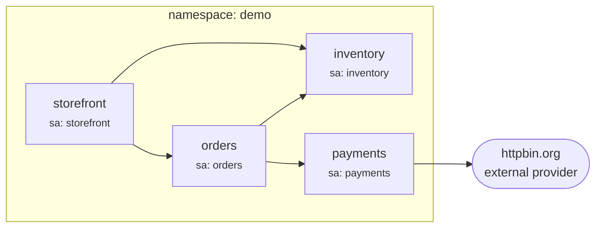
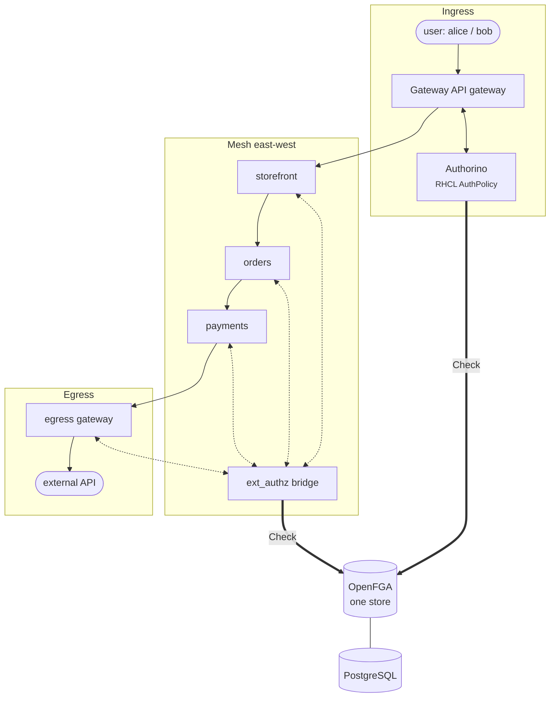

# How it all fits together

## The demo application

Four services in a `demo` namespace tell a storefront story. They're plain echo
containers — the *application* is deliberately boring so the *authorization* is
the whole show:

Each service runs under its **own ServiceAccount** — that's what gives each one a
distinct SPIFFE identity, and therefore a distinct subject in OpenFGA.

## The full request path

Three enforcement points, two enforcer components (Authorino at the edge, the
ext_authz bridge everywhere the mesh is), **one** store answering every Check.

## Identity mapping conventions

The glue between infrastructure identities and the OpenFGA graph is a pair of
naming conventions, applied consistently by the enforcers:

| Infrastructure identity | OpenFGA object |
|---|---|
| `spiffe://cluster.local/ns/demo/sa/storefront` | `workload:demo/storefront` |
| Authenticated principal at the gateway (e.g. API key owner `alice`) | `user:alice` |
| Kubernetes Service `orders.demo` | `service:orders` |
| Route exposed at the gateway | `route:storefront`, `route:storefront-admin` |
| External hostname | `host:httpbin.org` |

These conventions are the entire "schema mapping" — there is no sync process, no
controller reconciling Kubernetes objects into OpenFGA. The enforcers *derive*
the object names from the request at check time, and the tuples you write use
the same names.

## What is automated where

| Concern | Automation |
|---|---|
| Operators (OSSM 3, RHCL) | `deploy/operators` — OLM subscriptions, `make operators` |
| OpenFGA + PostgreSQL + store bootstrap | `deploy/openfga` + a bootstrap Job running the `fga` CLI, `make openfga` |
| Mesh control plane, demo app, mesh policies | `deploy/mesh`, `make mesh` |
| Gateway, routes, `AuthPolicy` | `deploy/ingress`, `make ingress` |
| Egress gateway + policies | `deploy/egress`, `make egress` |
| NetworkPolicy comparison harness | `deploy/perf`, `make perf` |

**Next:** [start the walkthrough](../walkthrough/00-prerequisites.md)
