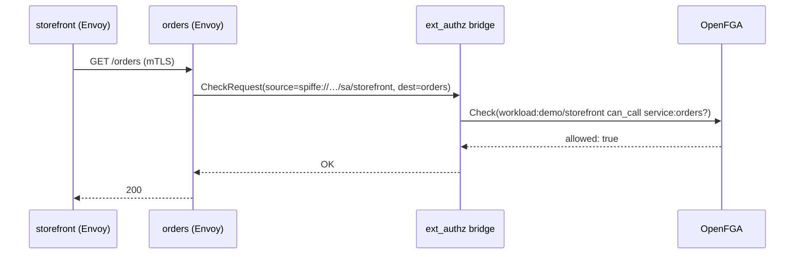

# What is OpenShift Service Mesh?

OpenShift Service Mesh (OSSM) is Red Hat's supported distribution of
[Istio](https://istio.io). Version 3 — used here — tracks upstream Istio closely
and is managed by an operator: you declare an `Istio` resource, the operator runs
the control plane.

A service mesh adds a small proxy (**Envoy**) next to each of your workloads.
All traffic in and out of the pod flows through it, which buys you three things
this demo depends on:

## 1. Workload identity (the big one)

The mesh issues every workload an X.509 certificate encoding a
[SPIFFE](https://spiffe.io) identity derived from its ServiceAccount:

```
spiffe://cluster.local/ns/demo/sa/storefront
```

All service-to-service traffic is **mutual TLS**: both sides prove their identity
cryptographically. That means when `orders` receives a request, the mesh *knows*
— not infers from an IP — that the caller is `storefront`. This identity is what
we hand to OpenFGA as the `user` in every mesh and egress Check.

!!! note "Why IPs aren't identities"
    NetworkPolicy selects pods by label and enforces by IP. IPs are recycled,
    NATed, and say nothing about *who* is making a request — only where a packet
    came from. SPIFFE identities survive pod restarts, rescheduling, and scaling,
    because they're bound to the ServiceAccount, not the network location.

## 2. A policy enforcement point on every hop

Envoy evaluates `AuthorizationPolicy` resources on each request. Istio's built-in
policies match static properties (principals, namespaces, paths). For decisions
that need external state — like a relationship graph — there's a fourth action:

```yaml
apiVersion: security.istio.io/v1
kind: AuthorizationPolicy
spec:
  action: CUSTOM
  provider:
    name: openfga-ext-authz    # registered in the mesh config
  rules: [{}]                  # delegate every request
```

`CUSTOM` tells Envoy to call out to an **external authorizer** (the
[ext_authz](https://www.envoyproxy.io/docs/envoy/latest/intro/arch_overview/security/ext_authz_filter)
protocol) and enforce its verdict. This repo ships that authorizer: a small
service that unpacks the request context — caller SPIFFE identity, target
service, method, path — turns it into an OpenFGA **Check**, and answers
allow/deny. That's the entire integration surface between the mesh and OpenFGA.



## 3. Gateways at the edges

Traffic entering or leaving the mesh flows through dedicated Envoy deployments —
**gateways** — giving the edges the same identity and policy machinery as the
interior:

- **Ingress:** a Gateway API `Gateway`, where Connectivity Link attaches its
  `AuthPolicy` ([next chapter](rhcl-101.md)).
- **Egress:** an egress gateway this demo routes outbound traffic through, so
  *leaving* the mesh is also subject to an OpenFGA decision
  ([chapter 5](../walkthrough/05-egress.md)).

**Next:** [What is Connectivity Link?](rhcl-101.md)
