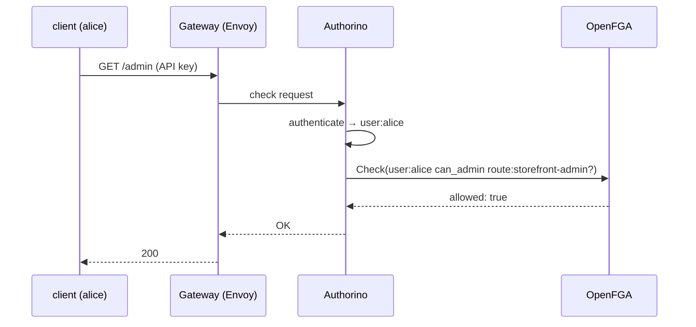

# What is Red Hat Connectivity Link?

Red Hat Connectivity Link (RHCL) is Red Hat's supported distribution of
[Kuadrant](https://kuadrant.io) — a set of operators that extend **Gateway API**
gateways with application-level connectivity policy: authentication,
authorization, rate limiting, DNS, and TLS.

## Gateway API in one minute

Gateway API is the successor to `Ingress`. Two resources matter here:

```yaml
kind: Gateway            # the listening infrastructure (ports, TLS, hostnames)
kind: HTTPRoute          # how requests are routed to Services
```

The Gateway is implemented by an underlying data plane — on this cluster, the
same Istio/Envoy machinery OSSM runs, which is what makes OSSM and RHCL such a
natural pairing: one data plane, two policy vocabularies.

## Policies that attach to the gateway

Kuadrant's model is **policy attachment**: you write a policy object that
references a `Gateway` or an `HTTPRoute`, and the operator wires the actual
enforcement into the data plane for you:

| Policy | What it does |
|---|---|
| **`AuthPolicy`** | Authentication & authorization per gateway/route — *the one this demo uses* |
| `RateLimitPolicy` | Request rate limits per gateway/route |
| `DNSPolicy` / `TLSPolicy` | Manage DNS records / TLS certs for gateway hostnames |

`AuthPolicy` is enforced by **Authorino**, Kuadrant's authorization service. An
`AuthPolicy` describes a pipeline: establish *who* is calling (API keys, JWTs,
OIDC…), optionally fetch external *metadata*, then evaluate *authorization*
rules. That metadata step is our OpenFGA hook at ingress:



At ingress the *subject* is a **user** identity established by Authorino; inside
the mesh it's a **workload** SPIFFE identity. Different identity planes, same
OpenFGA store, same model — which is exactly the "one authorization model"
argument this demo makes.

## Division of labor in this demo

| Enforcement point | Component | Subject | OpenFGA question |
|---|---|---|---|
| Ingress gateway | RHCL / Authorino | `user:alice` | `can_get` / `can_admin` on `route:…` |
| Every sidecar | OSSM / ext_authz bridge | `workload:demo/storefront` | `can_call` on `service:…` |
| Egress gateway | OSSM / ext_authz bridge | `workload:demo/payments` | `can_reach` on `host:…` |

**Next:** [How they fit together](architecture.md)
