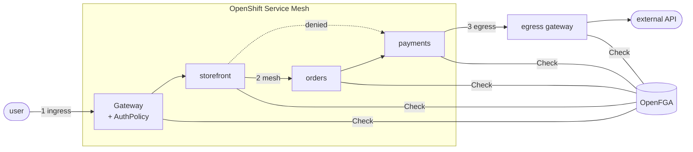

# One authorization model, three enforcement points

This is a self-guided demonstration of **fine-grained authorization** on OpenShift.
By the end of it you will have a cluster where every one of these questions is
answered by a single [OpenFGA](https://openfga.dev) store:

- :material-login: **Ingress** — *"May this **user** call this **route**?"*
  Enforced by **Red Hat Connectivity Link** at the Gateway API gateway.

- :material-swap-horizontal: **Mesh** — *"May this **workload** call this **service**?"*
  Enforced by **OpenShift Service Mesh** at every sidecar.

- :material-logout: **Egress** — *"May this **workload** reach this **external host**?"*
  Enforced by the Service Mesh **egress gateway**.

## Why would I want this?

Network-level controls (`NetworkPolicy`) answer *"may these IPs exchange packets?"*
Application-level authorization answers *"may this **identity** perform this
**action** on this **resource**?"* — and keeps the answer in one queryable,
auditable place.

With the policy expressed as **relationships** in OpenFGA:

- Changing who can call what is a **data change** (write a tuple), not a rollout —
  no manifests to apply, no pods to restart.
- You can **ask the reverse question**: "list everything `orders` may call" — try
  that with a pile of NetworkPolicies.
- The *same* model that guards service-to-service calls also guards user-facing
  routes and outbound traffic. One audit surface.

The [stretch-goal chapter](walkthrough/06-netpol-comparison.md) measures how this
approach and `NetworkPolicy` behave as policy count scales — they solve different
problems, and the comparison is honest about that.

## What you need

- An OpenShift cluster (4.19 or newer) with cluster-admin. **Everything else is
  automated** by this repository.
- No prior knowledge of OpenFGA, Service Mesh, or Connectivity Link — the
  [Concepts](concepts/openfga-101.md) section builds up each one from zero.

## How the walkthrough is structured

Each chapter follows the same rhythm: **explain → apply → verify → break it →
fix it in OpenFGA**. You will always see a request *denied* first, then write a
relationship tuple and watch the same request succeed — because seeing the deny
is what proves the enforcement is real.

[Start with the concepts :material-arrow-right:](concepts/openfga-101.md){ .md-button .md-button--primary }
[Skip to the walkthrough :material-arrow-right:](walkthrough/00-prerequisites.md){ .md-button }
